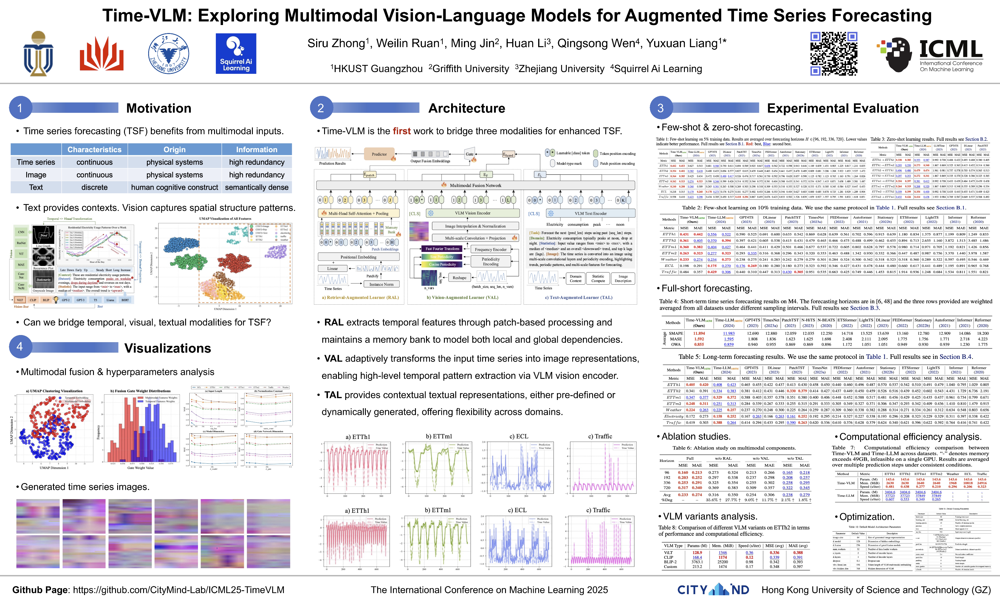

# Time-VLM: Exploring Multimodal Vision-Language Models for Augmented Time Series Forecasting

This repository provides the official PyTorch implementation of our paper:

"Time-VLM: Exploring Multimodal Vision-Language Models for Augmented Time Series Forecasting" [[Arxiv](https://arxiv.org/abs/2502.04395)] (Accepted at ICML 2025)

Time-VLM provides a highly extensible framework that facilitates the integration of various Vision-Language Models (VLMs) and different types of text/vision encoders. This flexibility enables researchers to conduct diverse multimodal time series research and experiments. For detailed implementation, please refer to `src/TimeVLM/vlm_custom.py` and `src/TimeVLM/vlm_manager.py`.

## Requirements
To set up the environment, install Python 3.8 with Pytorch 1.4.4. Use the following commands for convenience:
```bash
conda create -n Time-VLM python=3.8
conda activate Time-VLM
pip install -r requirements.txt
```

## Project Structure
Download the pre-processed datasets from [[Google Drive]](https://drive.google.com/drive/folders/13Cg1KYOlzM5C7K8gK8NfC-F3EYxkM3D2?usp=sharing) or [[Baidu Drive]](https://pan.baidu.com/s/1r3KhGd0Q9PJIUZdfEYoymg?pwd=i9iy). Place the downloaded data in the `./dataset` folder.
```
Time-VLM/
│───README.md                 # Project documentation
│───requirements.txt          # Python dependencies
│───run.py                    # Main entry point for training and testing
│───dataset/                  # Dataset directory
│   │───ETT/                  # ETT datasets
│   │───Weather/              # Weather dataset
│   │───Electricity/          # Electricity dataset
│   │───Traffic/              # Traffic dataset
│   └───...
│───scripts/                  # Training and evaluation scripts
│   │───full-shot/           # Full-shot learning scripts
│   │───few-shot/            # Few-shot learning scripts
│   │───zero-shot/           # Zero-shot learning scripts
│   └───...
│───src/                      # Source code
│   │───TimeVLM/             # Time-VLM model implementation
│   │   │───model.py         # Main model architecture
│   │   │───vlm_custom.py    # Custom VLM implementations
│   │   │───vlm_manager.py   # VLM manager for different types
│   │   └───...
│───utils/                    # Utility functions
│───models/                   # Model implementations
│───layers/                   # Custom layers
│───exp/                      # Experiment configurations
│───logs/                     # Training logs
│───ts_images/               # Generated time series images
└───...
```

## Quick Start
Run the following scripts for different forecasting tasks:

```bash
# Few-shot Forecasting
bash ./scripts/few-shot/TimeVLM_ETTh1_10p.sh

# Zero-shot Forecasting
bash ./scripts/zero-shot/TimeVLM_ETTh1_ETTh2.sh

# Full-shot Forecasting
bash ./scripts/full-shot/TimeVLM_ETTh1.sh
```

> **Note**: 
> - Make sure you have downloaded the datasets and placed them in the correct directory
> - The default parameters provided in scripts are a good starting point, but you need to adjust them based on your specific dataset and requirements. 

Here are the basic parameter configurations and tuning suggestions:

   - `d_model`: Model dimension (default: 128) [Most Important]
     - For longer forecasting horizon: try larger value such as 336 or 512
     - For larger datasets: try 256 or 512; For smaller datasets: 64 or 128 is sufficient
   - `dropout`: Dropout rate (default: 0.1)
     - Increase if you observe significant overfitting during training
     - Typical range: 0.1 - 0.5
     - Higher values (e.g., 0.3-0.5) for smaller datasets
     - Lower values (e.g., 0.1-0.2) for larger datasets
   - `learning_rate`: Learning rate (default: 0.001)
     - Try range: 0.0001 - 0.01
     - 0.001 is a moderate compromise effect.
   - `batch_size`: Batch size (default: 32)
     - Increase if you have enough GPU memory
     - Decrease if you encounter OOM errors
   - `image_size`: Image size (default: 56)
     - Larger sizes (112) for more detailed patterns
     - Smaller sizes (28) for faster processing
   - `periodicity`: Periodicity (default: 24)
     - Adjust based on your data's natural period
   - `norm_const`: Normalization constant (default: 0.4)
     - Range: 0.1 - 1.0
   - Enable `use_amp` for mixed precision training
   - Adjust `num_workers` based on your CPU cores
   - Set `finetune_vlm=True` if you have enough training data

### Key Arguments Explanation
- `task_name`: Type of forecasting task [long_term_forecast, few_shot_forecast, zero_shot_forecast, etc.]
- `is_training`: 1 for training, 0 for testing only
- `model`: Model name [TimeVLM, Transformer, Autoformer, etc.]
- `data`: Dataset name [ETTh1, ETTh2, Weather, etc.]
- `features`: Forecasting task type [M: multivariate, S: univariate]
- `seq_len`: Input sequence length
- `pred_len`: Prediction sequence length
- `d_model`: Model dimension
- `learning_rate`: Learning rate
- `batch_size`: Batch size
- `model_id`: Model ID for saving and logging
- `vlm_type`: VLMs type [vilt, clip, blip-2]
- `three_channel_image`: Whether to use three-channel image
- `finetune_vlm`: Whether to finetune the VLM
- `norm_const`: Normalization constant for data preprocessing
- `periodicity`: Periodicity of the time series data

## Citation
If you find this repository useful, please cite our paper.
```
@inproceedings{zhong2025time,
  title={Time-VLM: Exploring Multimodal Vision-Language Models for Augmented Time Series Forecasting},
  author={Zhong, Siru and Ruan, Weilin and Jin, Ming and Li, Huan and Wen, Qingsong and Liang, Yuxuan},
  booktitle={Proceedings of the 42nd International Conference on Machine Learning},
  year={2025}
}
```